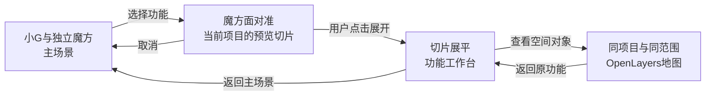

# 小G · 空间探索：视觉与交互方向复审

2026-09-14｜设计评审稿 R1｜本轮不实施前端

本次依据用户最新要求与其指定的 pasted-text.txt，先检查实际页面、代码和参考项目，再提出方向。此前“按总体方案实施”的授权不再作为继续旧视觉方案的依据。T02 已选机器人资产继续制作；T04–T08 暂停启动。本文件提出的方向尚不等于用户已确认的最终视觉稿。

**推荐方向：空间观测室。小G成为空间的主人，魔方成为观察项目的入口；同一块地图切片从魔方面延伸出来，最后接入真正的 GIS 工作台。** 首页的构图、功能选择的镜头、业务页的空间上下文一起调整，不能只把机器人放进现有右侧空位。

## 1. 当前体验诊断

### 1.1 本次实际检查

- 主目录：C:/Users/yxy/Desktop/work/AI_FOR_VECTOR。分支 session-1-loading-performance，HEAD 948e54803b644abcd1ca4ab3c0eaff0c5e7d15d7；包含 T03 尚未提交的前端修改。
- 本轮浏览器实际打开 http://127.0.0.1:18403/，依次检查首页、空间分析预览、展开后的 Analysis 页面；观察到真实项目 Walkthrough、图层选项和已有任务结果，没有提交分析。
- 阅读 ExperienceStage、ExperienceRoot、样式、状态 reducer、路由、六类业务页面、App、MapProvider、MapCanvas、WorkspaceSync、StatusBar、API 类型和本地 OpenLayers 类型声明。
- 地图生命周期判断来自当前源码；本轮未重新执行地图导入、编辑、导出验收。此前 T03 的测试记录只证明已有壳层阶段，不证明新设计。
- 已查看 T02 的 A_OpenGMS.png：珍珠白、青蓝眼睛、OpenGMS 胸标、圆润机器人。它是概念图；不能作为实际 GLB 造型、灯光或性能证据。

### 1.2 结构问题与表层问题

| 观察 | 类型 | 当前证据 | 对体验的影响 |
|---|---|---|---|
| 左侧大标题、右侧舞台槽、底部指南三块彼此独立 | 结构 | [ExperienceStage.tsx](C:/Users/yxy/Desktop/work/AI_FOR_VECTOR/web/src/experience/ui/ExperienceStage.tsx:69)；[两列布局](C:/Users/yxy/Desktop/work/AI_FOR_VECTOR/web/src/experience/experience.css:319) | 视线先读宣传语，再找功能；角色只是可以填入的插图位置 |
| 预览是覆盖舞台槽的文章卡片，立即随 selectedFeature 出现 | 结构 | [preview 的条件渲染](C:/Users/yxy/Desktop/work/AI_FOR_VECTOR/web/src/experience/ui/ExperienceStage.tsx:91) | 预览并非从魔方面生长，未来也可能占掉角色与魔方的关键位置 |
| 背景 ContourLines 是固定 SVG 路径，没有项目、范围或图层输入 | 语义/结构 | [ContourLines](C:/Users/yxy/Desktop/work/AI_FOR_VECTOR/web/src/experience/ui/ExperienceStage.tsx:13) | 换成金融或 AI 文案同样成立，GIS 身份停留在装饰上 |
| 动态由阶段计时与一段上移淡入组成，没有共同的空间对象 | 时间结构 | [阶段计时](C:/Users/yxy/Desktop/work/AI_FOR_VECTOR/web/src/experience/ExperienceRoot.tsx:66)；[preview 动画](C:/Users/yxy/Desktop/work/AI_FOR_VECTOR/web/src/experience/experience.css:658) | 有动画时间，没有镜头调度；550ms 结束并不代表用户看见了正确的面 |
| 只有 home 时渲染 ExperienceStage，业务内容另由 Outlet 呈现 | 连续性 | [ExperienceRoot.tsx](C:/Users/yxy/Desktop/work/AI_FOR_VECTOR/web/src/experience/ExperienceRoot.tsx:226)；[router.tsx](C:/Users/yxy/Desktop/work/AI_FOR_VECTOR/web/src/app/router.tsx:41) | 舞台和功能页没有共享的视觉锚点；导航实际上仍是换页 |
| 分析页从深色预览进入纯白表单，中文导航对应英文正文 | 样式/编辑节奏 | [platform 白底](C:/Users/yxy/Desktop/work/AI_FOR_VECTOR/web/src/experience/experience.css:635)；[AnalysisPage.tsx](C:/Users/yxy/Desktop/work/AI_FOR_VECTOR/web/src/pages/AnalysisPage.tsx:62)；本轮浏览器 | 明暗、语言、字号和内容位置同时跳变，像进入另一套产品 |
| 分析与导出各自用本地 projectId，空值回退项目列表第一项 | 业务上下文 | [AnalysisPage.tsx](C:/Users/yxy/Desktop/work/AI_FOR_VECTOR/web/src/pages/AnalysisPage.tsx:63)；[ExportsPage.tsx](C:/Users/yxy/Desktop/work/AI_FOR_VECTOR/web/src/pages/ExportsPage.tsx:32) | 即使镜头连续，也可能悄悄切换所操作的项目 |
| 首页标题最高可到 68px，而对白 12px、菜单文字 10px、辅助英文 9–10px | 视觉权重 | [experience.css](C:/Users/yxy/Desktop/work/AI_FOR_VECTOR/web/src/experience/experience.css:246) | 最醒目的是通用口号，最需要读的操作和对白反而弱 |
| 玻璃背景、青色按钮光晕、圆环、等高线集中在同一色域 | 表层 | [舞台背景](C:/Users/yxy/Desktop/work/AI_FOR_VECTOR/web/src/experience/experience.css:269)；[预览材质](C:/Users/yxy/Desktop/work/AI_FOR_VECTOR/web/src/experience/experience.css:480) | 深度依赖发光和渐变，缺少物体尺度、遮挡、接触阴影与真实透视 |

旧页是 T03 的功能壳层占位，不能据此评价尚未接入的机器人质量。但这次应更正旧设计对构图的安排：即使资产很好，大标题加悬浮卡片的结构也不会自动变成成熟的三维体验。

## 2. 最值得保留的部分

1. **功能清楚、入口明确。** 六个入口及真实 URL 可保留，魔方是增强入口，不承担唯一导航。普通链接、键盘、刷新、浏览器返回都应继续成立。
2. **T03 的状态与无障碍基础。** transitionId 排除过期回调、Esc 取消、焦点返回、减少动态和深链直接进入业务页，都是有价值的基础。美术重做不等于推翻这些代码。
3. **既有 GIS 工作能力。** 图层与属性表、编辑、样式、可调整面板、任务日志、重试/取消和导出表单必须保持效率。表格本身不是问题。
4. **真实空间素材入口已经存在。** Layer.extent、Project.view、图层顺序、项目缩略图、地图指针坐标、任务 projectId/layerId/result 可以支持有意义的视觉联系。
5. **地图的延迟加载与业务数据归属。** OpenLayers/属性表位于独立工作区，TanStack Query 管服务端数据。不要为首页画面让完整 GIS 引擎提前加载。
6. **用户已定的角色交互设定。** 珍珠白/青蓝机器人与 OpenGMS 胸标保留；魔方独立悬浮、平滑变速、选中停转、放大投影、点击进入完整页；不增加手部动作要求。

## 3. 缺少电影感与空间感的根因

**没有主角与空间的共同坐标。** 当前视觉组件都服从页面分栏，彼此没有距离、遮挡和镜头关系。背景线条穿过什么位置，对内容没有含义。

**没有能跨场景存续的对象。** 用户从预览进入工作台，标题、图形、角色、地图范围全部消失，只留下导航。连续性应先落在“正在看哪个项目、哪层数据、哪片区域”，动画再表达它。

**没有明确的注意力交接。** 标题一直很大，卡片又在另一侧出现；没有“先看小G → 视线到魔方 → 读项目切片 → 接管工作区”的顺序。真正重要的是让用户在每个时刻知道该看哪里。

**时间没有业务含义。** 计时结束、卡片进入和真实内容就绪互不关联。应区分镜头完成、数据加载、用户阅读、实际任务运行四种时间，不能用一条循环动画代替它们。

电影感来自取景、尺度和节奏；GIS 的空间感来自可解释的范围与图层关系。增加粒子、模糊、镜头抖动或更长加载动画都不能补足这两件事。

## 4. 参考研究：借原则，不照搬外观

以下研究于 2026-09-14 完成。将浏览器实见、官方机制说明、历史项目资料分开标注；设计迁移是本次判断，不是参考作者对本产品的建议。

| 项目与证据 | 本次核实范围 | 值得借鉴的原则 | 在小G中的应用与取舍 |
|---|---|---|---|
| [NASA Eyes on the Earth](https://eyes.nasa.gov/apps/earth/) | 实际打开，并从 Visible Earth 切换 Air Temperature；看到同一地球、图例、日期和资料名一同变化 | 主体持续存在，变化的是观察方式；说明附着于真实数据 | 项目地图片持续存在，数据/分析/任务改变它的解释。保留图例/日期语义；不借满屏卫星标签和星空 |
| [Google Earth Studio：Camera Target](https://earth.google.com/studio/docs/advanced-features/camera-target/) 与 [Easing](https://earth.google.com/studio/docs/en_gb/making-animations/easing/) | 阅读官方镜头和曲线说明，没有登录操作编辑器 | 镜头围绕明确目标运动，位置与旋转的节奏需协调 | 魔方对准和地图展开共用目标与时间轴；不每次从太空飞到城市，也不把该产品当运行时地图 SDK |
| [Smithsonian Voyager Tours](https://smithsonian.github.io/dpo-voyager/story/usage/tours-task/) | 官方文档说明相机、对象、灯光、注释可随步骤变化，用户可在导览中操作场景；本轮未完整运行其馆藏导览 | 场景分步讲解，但用户仍掌握节奏；信息在相应对象上出现 | 小G解释当前图层/分析结果；预览停下让人阅读，不自动接连播放六个功能 |
| [The Met Unframed](https://www.metmuseum.org/press-releases/the-met-unframed-2021-news) | 官方 2021 发布记录：大厅、主题入口与数字展厅；当时为限期五周项目，本轮不声称仍能完整访问 | 空间先建立方位，再通过主题引导内容 | 用于评估“数字地理展馆”备选方向；不照搬找门、找展品式操作，更不让导出成为闯关 |
| [Salk 虚拟建筑导览](https://www.salk.edu/about/visiting-salk/virtual-architecture-tour/) 与 [Buildings of Wonder](https://www.salk.edu/about/buildings-of-wonder/) | 实看官方页面的庭院构图，阅读空间介绍；没有完整播放嵌入视频 | 轴线、远景开口、受光平面与留白建立尺度；安静的空间也能很有张力 | 首页用一条通向魔方/地图片的斜向空间轴，靠柔和明暗和接触关系建立层次。参考建筑构图，不参考其网站菜单与信息框 |
| [Apple AirPods Pro 产品页](https://www.apple.com/airpods-pro/) | 实看首屏和向下滚动后的产品近看区；部分媒体报告无法播放，不将连续视频效果视为已验证 | 物体占据主视野，同一物体由整体转向局部细节；文字随观看目的改变权重 | 首页角色承担视觉中心，功能预览突出魔方面及项目内容；不复制宣传页的大标题、亮点卡片和长滚动营销结构 |
| [NYT Snow Fall 制作团队访谈](https://source.opennews.org/articles/how-we-made-snow-fall/)；[MIT 项目档案](https://docubase.mit.edu/project/snow-fall/) | 原项目页面本轮未成功打开；阅读制作团队关于阅读、地形、路径、时间与删减动效的说明 | 图像应在文字难以解释空间关系时出现；阅读节奏和数据时间不同，过度效果应删去 | 分析解释用真实输入/结果关系；对白与地图互相补充，避免复述按钮。滚动可用于可选说明，不接管工作区的滚轮 |

最有用的组合是 NASA 的对象连续性、Voyager 的用户控制、Salk 的空间留白和 Snow Fall 的编辑节奏。无需拼接它们的视觉符号。

## 5. 三个可选方向

| 方向 | 第一眼与运动方式 | 适合本产品之处 | 代价与风险 |
|---|---|---|---|
| **A 空间观测室，推荐** | 石墨色安静空间，珍珠白小G在中景，独立魔方在身侧；一张倾斜地图片延伸到前景。镜头短距离聚焦，地图片抬起、展开、接入工作区 | 角色仍是首页核心，地图是共同工作对象；从展示到操作距离短，可利用现有二维 GIS | 需要精确匹配角色尺度、灯光、地图平面与 HTML 锚点；构图不好仍会退化成角色加面板 |
| **B 地理远征** | 地球/区域/局部之间改变尺度，小G伴随观察，魔方作为坐标入口；主要语言是俯冲与区域聚焦 | 地理身份鲜明，适合宏观专题和面向公众的空间故事 | 当前没有完整地球/三维地形数据管线；小G易被地球抢走主角，长镜头不适合频繁任务，资源开销高 |
| **C 数字地理展馆** | 珍珠灰的展陈空间，地图和图层如展品，光线引导主题；通过短平移、揭示和局部特写组织内容 | 很适合教学、模型解释和成果展示，能融合亲和机器人 | 业务不是线性参观；数据列表与任务日志不能强行化为展柜。构建房间和路线增加维护成本 |

建议以 A 完成日常产品，仅在未来独立的专题讲解中使用 B 的尺度叙事或 C 的展陈节奏。此次不同时制造三个完整网站，也不新增一个与 GIS 并列的虚拟世界系统。

## 6. 推荐方向的构图与美术决定

### 6.1 空间不是背景壁纸

桌面首页只建立一个主场景：小G与用户一起站在一张空间图谱前。场地用简洁地面、渐远背景和一块地图平面构成，无需制作大型室内建筑。

- **前景**：地图平面的近边可以轻微出画，露出厚度或边缘遮挡，给出距离和尺度。轮廓来自当前项目范围；没有高程数据时不生成假山脉、假等高线。
- **中景**：小G完整轮廓是主要亮部，脸部首先被读到；魔方在身侧可独立看清，预览从这一侧展开。地图近边可以遮住地面，不能切过脸、胸标和魔方。
- **后景**：低细节、低饱和、柔和明暗过渡，与前景有空间衰减。不放随机粒子、漂浮网格、扫描环或星空。
- **负空间**：留给当前项目名、一个明确操作及必要对白。取消常驻两行巨型宣传语；首页短句只承担初次引导，不与角色抢中心。

初步取景比例，用于之后真实模型关键帧校准，而非刚性 CSS 参数：在 1440×900 画幅中，小G约占有效视口高度的 52%–60%，脸部中心约在 x=44%、y=35%；魔方约在 x=63%、y=49%；地图前景向右下延伸。顶部保留品牌与项目状态，左右边缘保留导航/信息安全区。最终比例需依据真实 GLB 外轮廓和相机测试调整。

不通过放大头部、夸张广角或强发光追求“3A”。当前选中的机器人本身具有卡通比例，精致感应来自材质、接触阴影、视线、细节可读性和动作节奏；不再次擅自换成人类角色。

### 6.2 材质与照明

候选色板：背景石墨蓝灰 #11191F，工作表面 #202B32，主要文字/角色高光偏珍珠白 #ECE8DF，次级文字 #ABB7BC，交互强调用低饱和青色 #78B6BC。色值是设计起点，实际文字对比度须在最终画面验证。

主光采用宽而柔的中性偏暖光，辅助冷光只用于分离轮廓。青色保留在眼睛、少量魔方材质及当前选择上；调低后续场景的环境蓝染，不推翻用户已选涂装。投影本质是一张可读的空间切片，边缘可半透明，正文区域有稳定对比，不依赖大片玻璃模糊。

雾感只帮助远近衰减，不进入文字、表格与地图判读区域。首版不以实时体积雾、景深、Bloom、反射或全屏后处理为必需；优先真实光照与克制材质。

### 6.3 字体与对白

- 中文承担标题、导航、表单与提示主语言；英文只用于确有用途的术语、代码或辅助识别，不给每条信息都配大写英文标签。
- 候选层级：业务标题 28–36px、首页短标题不超过约 40px、正文/对白 16–18px、菜单 14–16px、坐标/单位 12–13px。密集表格可以保留合理紧凑字号，不能全站强行放大。
- 中文正文一行约 24–34 字；英文约 45–65 个字符。保留现有字体体系并补齐中文系统回退，不下载完整大体积中文字体。等宽字体只用于坐标、数值、标识符。
- 标题沿共同基线从投影迁移到业务页页首；不每页飞入新标题，不逐字打字拖延阅读。
- 白话围绕当前操作：例如“先选输入图层，再设置缓冲距离。”真实成功后才出现“结果已生成，可在地图查看。”没有输入/结果时不虚构数据或分析判断。
- 对白占底部场景内的安静区域，以局部暗幕保证可读性；保留可选中 HTML、实际按钮和礼貌播报。不呈现聊天气泡、独立聊天窗或粗边框底栏。用户选择作为轻量文本回应，长日志仍回到任务页。
- 进入业务页后小G缩到页首侧边的小型陪伴位置，默认安静。明确提示才展开对白；不能覆盖地图要素、表格单元格或错误信息。

### 6.4 窄屏重新取景

390×844 竖屏采用更近的角色构图，保留脸部、胸标和身侧魔方；主场景约占上部 320–380px，投影与对白按阅读顺序进入下部，不把桌面三层内容等比缩成一团。导航使用可展开的文字菜单，主要触控区目标不小于 44px。用户打开业务页后，参数/列表进入正常单列流，小G收为页首陪伴位置；键盘弹起不顶起整个 3D 场景。触屏关闭指针视差，低性能档使用同一资产导出的静态画面。横屏另以可用高度取景，不根据设备名称硬编码位置。

## 7. 场景与运动语言

### 7.1 一个对象，几个观察方式

这里的“同一块切片”是用户可识别的视觉对象与上下文，不要求把所有业务页面真的绘制进一块 WebGL 纹理。地图、数据、任务各有真实 HTML 内容，依靠位置、项目名和选中对象接续。

### 7.2 六个入口如何连续

| 入口 | 空间表达与目的地 | 必须连续的内容 | 不能硬套的表达 |
|---|---|---|---|
| 项目空间 | 总览图谱中明确标记选中项目范围，列表和范围建立对应；打开详情后保留同项目名与范围 | 项目 id、标题、范围、返回位置 | 不因鼠标路过项目就改变实际工作项目，不把所有项目详情在首页一起下载 |
| 数据资源 | 当前图层从项目关系中被强调；字段、来源与范围在相邻阅读区展开 | layerId、所属项目、目录筛选；未绑定表保留独立身份 | 原始 PostGIS 表可能没有 projectId/extent，不能编造项目归属或地图位置 |
| 空间分析 | 沿同一范围显示“输入 → 方法 → 结果”关系；空间预览与参数邻接 | 选中项目、合法输入图层、任务与结果关联 | 用户未运行前只展示范围/输入提示，不将装饰扩散动画冒充真实缓冲结果 |
| 任务进度 | 以时间列表解释真实作业，选中任务才关联对应项目/图层；适度复用地图缩略 | taskId、状态、日志和可用结果 | 任务属于时间与作业，不应伪装成地球位置；不估造连续百分比 |
| 导出交付 | 选中成果保持高亮，交付格式、字段、CRS与真实提交状态并列阅读 | projectId、layerId、合法格式和结果 | 当前导出表单未提供任意地图框选裁剪；不画可拖拽裁剪框承诺不存在的能力 |
| 平台概览 | 从单项目退到跨项目的索引视野，统计和最近项目保留高效率列表 | 平台统计、最近对象、回到原项目的路径 | 全局概览不偷偷锁死为当前项目，不强行放大为一个地球驾驶舱 |

六个魔方面仍可映射六项功能，但业务页面内切换无需每次回到魔方重新表演。项目选择是明确的业务动作；地图范围和选中图层不能因为切换视觉模式而重置。

### 7.3 代表镜头：从首页选择空间分析

按 60fps 编写故事板，**Frame 0 为用户点击“空间分析”的瞬间**。帧号用于沟通节奏，实际运行按时间插值，不能依赖设备恰好达到 60fps。1.5s 和 3s 是观察点，不是强制等待时长。

| 时刻 | 镜头与空间 | 魔方/地图 | 文字、光线和交互 |
|---|---|---|---|
| Frame 0 / 0ms | 保持完整中景，小G脸部仍清楚，镜头尚未移动 | 从当前角速度连续开始收束，目标为分析面，不先瞬移回默认姿态 | 导航立即确认选中；底部给出一句简短反馈；读取已有项目上下文。导航始终可用 |
| Frame 30 / 500ms | 视线向魔方偏移，轻微推进约 2%–4%，小G完整轮廓向左让出负空间 | 目标面已基本对准；其轮廓延伸出地图片，先有边界、后有内容，开始展平 | 功能标题沿展开边出现；受光面积随平面变化，环境曝光保持稳定。新选择可立即打断旧镜头 |
| Frame 90 / 1500ms | 镜头已停，不持续晃动；前景切片、中景角色、后景环境仍可区分 | 正常约 800–900ms 内完成预览构图；原魔方保留，投影有清晰来源。显示真实范围/元数据，未就绪则明确加载状态 | 标题、简短说明及“展开工作台”完整可读；按钮不等到本帧才可用。没有项目时提供选择项目入口 |
| Frame 180 / 3000ms | 保持构图，让人阅读 | 魔方保持静止；地图不会自动切换或运行分析 | 留出停顿，等待用户；不自动展开页面。用户可以取消、选其他功能、直接进入 |
| 用户点击展开 / 新时间轴约 450–650ms | 地图片沿自身法线接近视口，倾角收敛为正面；不穿过魔方、不翻转整个屏幕 | 预览轮廓与工作台内容区域匹配，项目名及范围接续。不是放大一张低清截图到全屏 | 标题移至页首；业务表单就绪后接管；小G随构图收至页首陪伴位置，保持同一身份与材质 |
| 目的地 / 稳定态 | 地图/空间预览与参数形成明确工作区域，镜头停止 | 此时是实际 Analysis 页面与真实表单；未运行无“结果”图层 | 表单、Tab、滚动即时响应；真实任务状态在正确位置更新，不让环境持续旋转分散注意力 |

首页初次出现用已经可读的构图开始，真实模型加载前有同构图静态降级。无需黑屏片头或强制 3 秒开场。首次短揭示可在 600–900ms 内发生，但不扣住导航。

### 7.4 不同动作的节奏

- 魔方待机：保留平滑变速，初始可沿用已有 0.25–0.65 rad/s、8 秒周期参数，再以实模录像判断是否过快。只持续旋转魔方；相机默认静止，角色仅自然待机。
- 功能聚焦：约 400–550ms；投影约 300–450ms，与聚焦尾段衔接。朝向采用连续插值，起止速度协调，避免弹簧回弹和突然换轴。
- 业务页内切换：通常 120–220ms 的位置/透明度接续，数据未加载时立即显示可用骨架，不强迫再看主场景。
- 定位某个地图对象：只有明确“定位/查看范围”才调用地图相机；用户拖拽/滚轮马上取得控制。普通字段选择、表格排序不移动地图。
- 返回：沿相同空间轴缩回，保留项目与位置；浏览器后退、直接深链可简化为短淡入或无动画，不强制倒放整段电影。
- 指针：精细指针可触发很轻的场景视差，控制幅度并在离开时收敛；触屏与减少动态关闭。地图上的拖动只属于 OpenLayers。
- 滚动：列表与表单滚动完全保留。只有未来可选的专题解释可用滚动控制图层揭示，不使用全局滚动劫持或模拟惯性滚动。

## 8. 哪些页面和组件需要重新考虑结构

| 范围 | 建议改变 | 保留与边界 |
|---|---|---|
| ExperienceStage / experience.css | 用一个完整取景代替 intro + stage-slot；明确场景、投影、对白、导航各自的深度与安全区 | 导航与文字仍是 HTML，不将全站变成画布热点 |
| ExperienceRoot / reducer / motionConfig | 保留阶段与取消契约，增加真实动画完成信号、内容就绪和共同时间轴；分别管理展示与导航 | 不把动画时间线变成第二套路由，不用视觉重渲染重置 Outlet |
| featureRegistry | 保留 id、href、面法线；对白从固定介绍逐步接入明确的项目/图层/任务上下文 | 不在注册表放 Query、业务提交逻辑或虚构 AI 回答 |
| PlatformShell / AppShell / router | 统一页首、陪伴位置、项目上下文与材质过渡；先定义页面入口参数再改布局 | 地图继续独立 lazy 边界；不为持久背景提前常驻整个地图编辑器 |
| ProjectsPage / ProjectOverviewPage | 列表与选中范围形成主从关系；项目详情保留同一范围与标题 | 选择项目、打开地图仍为清楚的显式操作；保留空态和错误态 |
| DataCatalogPage / DatasetDetailsPage | 目录、字段/来源、空间范围邻接；选中项与地图/详情建立联系 | 保存搜索和筛选，未绑定表正常列出，样式编辑不搬成伪 3D 面板 |
| AnalysisPage | 让项目、输入图层、方法与结果可在同一语境理解；参数仍使用真实表单 | 当前七类工具、字段校验、任务提交与轮询保持；首版范围预览可用轻量图形，进入真地图才加载 OL |
| TasksPage | 保留高密度时间表、状态筛选与行内日志；选中任务关联项目和可用结果 | 全局任务视图仍有明确“全部”；重试/取消/错误信息的优先级高于小G对白 |
| ExportsPage | 选中成果与输出参数相邻，统一输入图层和项目上下文 | 矢量/栅格不同能力不合并伪装；没有业务能力的地图裁剪不加入首版 |
| DashboardPage | 改成清楚的全局索引视野，保留数字、最近对象、项目缩略入口 | 无需每个数字一张玻璃卡，也不必废掉有效的统计与列表 |
| MapCanvas / MapProvider / WorkspaceSync | 为真实地图接续定义可取消的相机控制和返回上下文；避免转场改写地图状态 | 图层渲染、选中、编辑队列、布局和缩略图机制不因美术顺手重构 |

原 T06“统一换肤”不足以覆盖这里的结构工作。正式实施前，应把项目上下文契约纳入主模型设计与验证，Luna 只执行已明确的布局和样式边界；不要让逐页实现自行决定如何继承项目或返回地图。

## 9. 技术路径、风险与验证目标

### 9.1 当前技术事实

[package.json](C:/Users/yxy/Desktop/work/AI_FOR_VECTOR/web/package.json) 显示 React 19、React Router 8、TanStack Query 5、Zustand 5、OpenLayers 10.9；当前没有 Three.js、R3F 或 GSAP 依赖。OpenLayers 官网本次最新文档为 10.10，本文使用的 animate、fit、cancelAnimations 也已在本地 10.9 的 View.d.ts 查到；不因设计研究升级依赖。

### 9.2 职责分配

| 技术 | 本产品适用位置 | 判断 |
|---|---|---|
| CSS / Web Animations | 文本、导航、列表、短淡入、HTML 投影的 transform/opacity | 默认方案；保持业务 DOM 可访问，避免逐帧修改会导致布局计算的宽高 |
| Three.js + R3F | 小G、独立魔方、地面/地图片的空间关系、材质与实际镜头 | 真实 3D 主角使它有明确价值；按需接入一个受控 Canvas，非整站 3D 引擎 |
| GSAP | 若多对象镜头需标签、暂停、取消、统一进度，可做舞台唯一时间线 | 候选而非本轮定装依赖；若短插值已满足，不追加。若采用，按 [官方 context 清理机制](https://gsap.com/docs/v3/GSAP/gsap.context()/) 处理 React 重挂载；不同时让 CSS、GSAP 和 useFrame 写同一属性 |
| OpenLayers View | 实际地图的中心、缩放、范围定位与取消 | 使用 [View 的二维相机能力](https://openlayers.org/en/latest/apidoc/module-ol_View-View.html)。三维舞台相机与地图 View 是两个职责，不能假装现有 OL 支持地球俯仰、真实地形飞行 |
| SVG / 静态图 | 项目范围、图层关系、低成本缩略与模型降级图 | 复用数据驱动的 ExtentSketch 思路；先核实 CRS/反经线/空范围。它不是有比例尺的精确地图 |
| View Transitions | 标题、选中行、项目缩略等 DOM 元素接续 | 按 [MDN](https://developer.mozilla.org/en-US/docs/Web/API/View_Transition_API) 做特性检测与无动画回退。快照过渡不能替代 WebGL 实时相机，也不保证地图状态自动保留；不依赖新实验特性作为唯一链路 |
| 自定义 shader / 后处理 | 只有低成本的材质揭示确有必要时再选用 | 首版不做体积云、全屏噪声、复杂实时折射，不将 shader 当高级感前提 |
| Cesium / 另一个地球引擎 | 只有后续明确的全球/三维地理业务 | 推荐 A 无此需求，不引入双地图引擎 |

### 9.3 上下文与连续性的边界

1. **URL 保持业务入口权威。** 现有路径保留。建议下一设计阶段定义可选 project/layer/task 查询参数和校验，显式选择优先，其次为合法返回上下文；深链没有上下文则显示选择项目，而不是默默换到第一项。默认行为改变必须单列验证。
2. **Query 仍持有服务端数据。** 展示层只引用 id、标题、合法范围和轻量视图快照，不复制整份项目/图层进动画 store，不另建一套全局业务状态。
3. **跨页保留地图范围需要实际补足。** [WorkspaceSync](C:/Users/yxy/Desktop/work/AI_FOR_VECTOR/web/src/map/WorkspaceSync.tsx:56) 更新 view/sel 查询参数并上传缩略；[App](C:/Users/yxy/Desktop/work/AI_FOR_VECTOR/web/src/App.tsx:59) 只在挂载时读取初始 URL；lastProject 只保存项目 id。现在不能声称返回任意页面都能自动恢复完整地图。应保存合法内部 return URL；同项目 query 更新与切换项目需要专项处理，不能只加转场 CSS。
4. **连续画面不等于常驻编辑器。** 保持 OL 为单个活动地图。离开地图前后的呈现可用受控占位和视图参数接续；既有未提交编辑的生命周期必须单独检查，不能靠缓存一张图片假装草稿仍在。
5. **低清缩略不能承担全屏电影画面。** 现有 captureThumbnail 为 256×128，且以多个 canvas 合成。它适合作为小图/模糊远景，不适合放大全屏，更不能默认所有瓦片都可安全复制。首版用范围图保持身份，地图就绪后由真实地图接管；若以后加高清快照，需单列 CORS、尺寸、图层变换与内存验证。
6. **地图不得因场景镜头而移动。** 舞台相机运动不触发 OL moveend/缩略上传。真正的地图定位需要用户明确操作，cancelAnimations 交回控制；取消完成回调必须判断成功与 transitionId。
7. **业务与展示时间分开。** 加载错误、模型错误、任务失败直接可读。动画结束不意味着 API 成功；低帧率也不能让导航永久停在 expanding。所有清理/降级路径要有确定终点。

### 9.4 性能目标，而非已取得的成绩

- 暂沿用原资产上限作为预检目标：标准 GLB ≤12MB、角色 ≤100k 三角面、魔方 ≤25k、展示场景 ≤150k、draw calls ≤80。T02 实际输出和浏览器评估后再决定质量档位；上限本身不证明 60fps。
- 首页只读取当前需要的项目摘要/选中项目；目录原本会查询各项目详情，不能将这条调用链无界复制到首页背景。
- 桌面显示动画期间目标为稳定接近 60fps；低性能档目标为可用的 30fps 或静态呈现。记录设备、画幅、DPR、资产版本、帧时间与长任务，不用静态截图声称流畅。
- 初始 DPR 可封顶 1.5，触屏低性能档 1；按实测调整。贴图显存、阴影与透明投影叠层可能比模型三角面更先成为瓶颈。
- 魔方在动就需要渲染；不能宣称开启 demand 后旋转“零开销”。停转/隐藏/业务操作期才减少更新。R3F 官方 [按需渲染说明](https://raw.githubusercontent.com/pmndrs/react-three-fiber/master/docs/advanced/scaling-performance.mdx) 支持这一边界。
- 陪伴位置采用同一场景的受控缩小视口，低性能或地图忙时使用同资产导出的静态头像；不为左上角另开第二个角色 Canvas。
- 确认主体后才按需预取目标路由/所需数据；导航反馈目标 <100ms，不能等 GLB 下载或 shader 编译结束才响应。
- 地图转场只持续到内容可接管；瓦片慢时允许工作区立即操作并显示加载，不能无限保持全屏遮罩。

后续验证至少涵盖：冷启动/模型失败、减少动态、快速连点/取消、直接深链/返回、无项目/无 extent/未绑定表、不同项目继承、地图拖拽与字幕事件分流、未提交编辑、长表格、手机横竖屏，以及真实 GLB + 地图同时存在时的资源变化。业务 API、CRS、距离单位、结果引用与下载链必须保持可验证。

## 10. 本轮不应改变的内容与后续衔接

**保留不动：** 后端 API/数据库/任务执行、既有业务字段与算法、图层本身的颜色/透明度/顺序、用户地图底图选择、导入编辑能力、任务真实状态、URL 深链、Query 数据归属、正常滚动与键盘操作。不要为统一视觉给整张地图套调色滤镜，改变用户对图例和结果的判断。

**已经取消的要求不复活：** 不新增手部动作、不绑定手骨托魔方、不要求四套定制手势；不重新选择角色，不将概念图或 Snow 历史资产当新机器人完成证据。胸标 OpenGMS 不自动触发全项目命名替换。

**本轮交付边界：** 完成源代码/实页审阅、参考研究、三方向比较、推荐构图、时间分镜、组件影响与技术边界；没有实施页面、安装前端依赖、提交或推送代码。旧视觉方案的 T04–T08 不自动继续。

本轮核对了 128 个前端源文件/依赖清单及受保护后端文件的前后哈希，变更为零；检查四份本次设计/交接文档中的 22 个绝对本地链接，无失效目标。没有为纯设计文档重复运行整套应用测试。验证记录见 [review-verification.json](C:/Users/yxy/Desktop/work/AI_FOR_VECTOR/artifacts/xiaog/design-review-20260914/review-verification.json)。

**不必等机器人才能完成的设计：** 构图主次、六项业务的连续对象、镜头节奏、文字层级、参数/结果布局和性能边界已经在本文给出。

**应等实际机器人校准的部分：** 相机焦距与站位、脸部/胸标可读性、魔方间距、受光强弱、进入陪伴位置后的大小，以及在 1440×900、1920×1080、390×844 下的遮挡。真实模型到位后，用同一资产制作关键帧对照与短镜头样片，再判断材质和运动；不以更换角色解决结构问题。

若进入下一阶段，建议先开一个完整的新任务“D01 空间观测室关键帧与镜头样片”，只验证首屏、聚焦、预览、展开、工作台、移动端六个代表画面及一段连续样片；这仍是后续建议，本轮未创建或启动。通过设计评审后再更新 T04–T08 提示词与输入契约，按用户要求一阶段一新任务执行。

设计验收应回答：去掉口号后是否仍认得小G与地理产品；停止所有装饰运动后构图是否成立；是否能看懂从哪个魔方面到哪个项目/图层；进入功能后是否仍在同一个工作语境；长时间编辑时是否安静清楚。未回答这些问题之前，不以“动效更多”作为完成标准。
