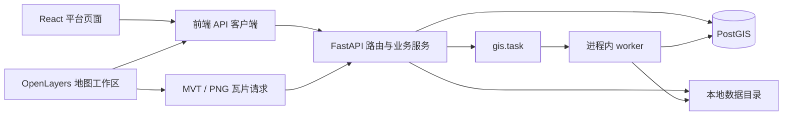

# 系统架构

[返回目录](README.md) · [业务映射](business-map.md) · [代码地图](ai/code-map.md)

## 运行结构

[main.tsx](../web/src/main.tsx)启动 React；[router.tsx](../web/src/app/router.tsx)把平台页面和懒加载地图工作区分为兄弟路由。[main.py](../backend/app/main.py)组装 API、CORS、异常处理与 lifespan。数据库容器由 [Compose](../docker-compose.yml)提供；API 与 Vite 分别运行。

后端常见调用方向是路由 → service → repository → 数据库。并非所有服务都有 repository：任务、分析及导出服务也直接使用 SQLAlchemy/SQL。地理文件读写由线程执行阻塞库调用；任务调度本身是进程内 asyncio 循环，未使用消息中间件。

## 数据与业务所有权

| 对象 | 所有者 / 位置 | 关系与职责 |
|---|---|---|
| Project | [project.py](../backend/app/models/project.py)，默认 `gis.project` | 保存名称、地图视图，拥有多个 Layer |
| Layer | [layer.py](../backend/app/models/layer.py)，默认 `gis.layer` | 保存 source/style JSONB、可见性、顺序与统计信息；同项目名称唯一 |
| Task | [task.py](../backend/app/models/task.py)，默认 `gis.task` | 保存执行状态、参数、结果、日志、来源及重试关系 |
| 矢量实体 | 默认 `gis_data` 动态表或已注册的现有表 | PostGIS geometry 与属性列；source 定位表、几何列、主键和 SRID |
| 栅格与文件 | [config.py](../backend/app/core/config.py)的 data_dir | rasters、tmp；另有 thumbnails 与 exports 子目录 |
| UI 状态 | Query / Zustand / OpenLayers / localStorage | 见[前端说明](reference/frontend.md)，不能把浏览器状态当作数据库事实 |

Layer 是当前数据目录的主体；未发现独立 Dataset ORM、用户、角色或组织模型。数据目录不是独立复制一份空间数据。

项目删除会通过外键级联删除 Layer 与 Task 元数据；删除 Layer 后 Task.layer_id 置空。实际入口仅调用元数据 repository，未实现引用计数式空间表、栅格与导出文件回收，见 [project_service.py](../backend/app/services/project_service.py) 与 [layer_service.py](../backend/app/services/layer_service.py)。

## 三类业务流程

**交互请求。** 路由解析 Pydantic 契约；service 验证业务和来源；SQL 或文件操作生成结果。普通数据库请求由 [get_session](../backend/app/db/session.py)在响应发出前提交，异常回滚。JSON 使用 camelCase，错误采用统一 error 对象；二进制瓦片、下载和 204 是例外。

**导入。** 文件导入经过上传限制、读取、坐标标准化、写表/索引和 Layer 注册。草稿路径先在浏览器 Worker 解析并编辑，再由服务器重新校验。矢量批量写入使用独立同步连接，不能视为与 HTTP 元数据事务天然原子；[vector_import_service.py](../backend/app/services/vector_import_service.py)实现异常清理补偿。栅格路径写本地文件并注册来源。

**后台工作。** 提交接口保存 queued 任务并返回 202；[task_worker.py](../backend/app/services/task_worker.py)领取任务，再按 handler 执行矢量导入、分析或导出。分析产生可继续查看的普通 Layer；导出产生文件及下载结果。进度在真实阶段边界提交，取消在检查点生效。取消请求不保证终态为 cancelled，完成中的工作仍可能 succeeded。重试创建新任务并记录 retry_of，详见[后端参考](reference/backend.md)。

## 地图加载和缓存

[loadingTiers.ts](../web/src/map/loadingTiers.ts)按 PostGIS 图层 featureCount 分级：≤2,000 全范围 GeoJSON；2,001–50,000 或未知数量走 BBOX；>50,000 用 MVT。小图层仍受服务器限制，修改服务端上限时需同步评估前端常量。大图层 MVT 渲染对象不提供地图几何编辑。

后端已接入来源快照缓存、MVT 字节缓存与栅格句柄池。浏览器 [geoCache.ts](../web/src/cache/geoCache.ts)已实现内存、IndexedDB、条件请求和失效逻辑，但当前 [featureLoader.ts](../web/src/map/featureLoader.ts) → [api/features.ts](../web/src/api/features.ts)直接调用 apiFetch；[layerFactory.ts](../web/src/map/layerFactory.ts)直接向 OpenLayers 提供瓦片 URL，未接入 geoCache。不能据独立缓存单测宣称地图已具备离线缓存或预取。

## 当前边界

- 后端支持保存 Project.view，但当前 WorkspaceSync 的相机移动只写 URL 并上传缩略图，未调用项目 PATCH 保存相机；不能把 URL 恢复描述为自动保存到数据库。
- 启动恢复将所有 running/cancelling 任务标为 interrupted 失败。虽然领取使用 SKIP LOCKED，这不足以证明多实例启动恢复安全；按当前单后端运行方式理解。
- [health.py](../backend/app/api/v1/routes/health.py)只返回状态和环境，不查询数据库；HTTP 200 不等于数据库或全部业务就绪。
- [edit_service.py](../backend/app/services/edit_service.py)写实体行，但未同步更新 Layer.updated_at、extent、feature_count。不能假设编辑自动更新所有元数据和版本缓存。
- 前端 EditQueue 逐条发送请求，支持部分成功与失败保留；不是整个编辑会话的数据库事务。
- 未发现认证授权实现、完整生产部署编排或自动孤儿资源清理服务。历史计划中的这些目标不能当作现状。

以上是本次文档核对记录的既有边界，不是本次引入的代码缺陷；本次未改动业务实现。
