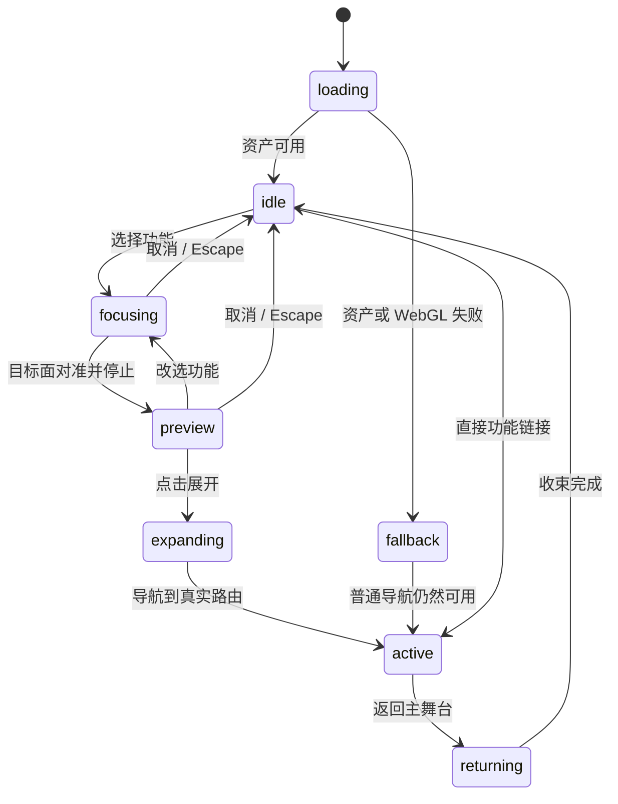

# 小G · 游戏式 GIS 前端重构总方案

> **最新交付：**[07 完整设计交付](C:/Users/yxy/Desktop/work/AI_FOR_VECTOR/docs/xiaog-game/07-design-delivery.md)。D01 的真实模型交互原型、六页、地图设计、响应式画面、样片及复核包已完成。实际视觉参数以交付包 design-spec.md 为准，正式实现依据 05/06。以下早期评审/制作状态仅保留历史，不覆盖此更新。

> 后续更新：用户已授权将“空间观测室”推进到完整可交付设计。D01 制作真实模型交互原型、六个目的页、关键帧和镜头样片；主协调补齐 [05 设计契约](C:/Users/yxy/Desktop/work/AI_FOR_VECTOR/docs/xiaog-game/05-design-delivery-contract.md)与 [06 实施交接 R2](C:/Users/yxy/Desktop/work/AI_FOR_VECTOR/docs/xiaog-game/06-implementation-plan-r2.md)。下文旧构图和旧实施安排不恢复为当前指令，实时状态见03。

日期：2026-09-14。状态：用户最新要求先重审设计，本轮不实施前端；实时阶段状态见 [03-execution-status.md](03-execution-status.md)。

> 设计修订 R1：先读 [04-design-direction-review.md](C:/Users/yxy/Desktop/work/AI_FOR_VECTOR/docs/xiaog-game/04-design-direction-review.md)。用户已否决当前页面方向，本文原有首页分栏、玻璃预览、环境光效和后续逐页换肤安排不再直接作为实施依据。新推荐为“空间观测室”，目前属于设计评审稿，尚非最终视觉定稿。保留真实路由、独立魔方、无需手部动作和既有业务能力等约定。T02 机器人资产继续制作；T04–T08 暂停启动，不能在机器人完成后自动沿用旧稿接入。

本方案对应用户本次需求。附带的《Blender 建模工作流与任务交接指南》仅提供制作方法，不将平城万象录的资产、目录、历史参数或旧任务指令视为本项目需求。

## 1. 产品目标与设计决定

把当前 GIS 平台改造成由小G引导的空间探索工作台。打开页面首先看见真实三维小G与独立悬浮的魔方；导航、对话、全息预览、功能页面使用同一套空间和视觉语言。项目、数据、分析、任务、导出、地图编辑等现有能力继续可用。

当前角色定稿：用户选择**④ RobotExpressive / Quaternius**为基础，已从平面概念中选定**A珍珠白/青蓝**，并明确胸口字样改为**OpenGMS**。按此前“选图后建模”授权继续T02 Blender修改，无需再次确认开工。原A概念图：C:/Users/yxy/.codex/generated_images/01a09fd2-e69e-7a11-8156-3a8332754ef3/exec-d4d792b4-5678-4805-8d76-5995a7e3d833.png；其胸口标识需按最新要求更新。概念图仅用于外观设计，不代表Blender成品或几何验证。

Snow效果此前被用户否决，停止精修及正式接入；保留已有源和导出作为未被接受的技术实验。不得用其技术可加载状态代替新机器人验收。

历史记录：用户此前选择 Snow v4，提出亚洲人物外观、寸头、白色肤色。这些是已中止 Snow 分支的要求，不自动套用到新机器人。整体保持成熟材质、灵动动作、亲和表现和可替换角色接口。

主舞台以克制的电影式布光、成熟材质、清晰主次和细腻动作承载角色；深蓝空间、青蓝全息光和少量暖色作为初始界面方向，待角色选定再匹配。中文导航与引导文案。3A 是美术目标，不能将作者宣传图或高模截图当成网页已达到的效果。

用户最新简化要求：不需要考虑手部动作，直接通过魔方转动实现交互。魔方独立悬浮于角色身前或身旁，整体持续平滑变速旋转；选择功能后停转对准，再投射预览。不要求托举姿势、手势、抓握或手部骨骼适配。首版保留3×3外观，不制作自动打乱、逐层还原或解魔方算法。人物与魔方不互相遮挡/穿插即可。

“融入背景的对话”指视觉呈现：底部渐变暗幕、角色名、对白文字和轻量选项；没有独立白卡、聊天气泡和侧边聊天窗。代码仍拆成可维护组件，文字仍采用可选中、可聚焦的 HTML。

首版对白是功能介绍、上下文提示、操作结果和快捷选项。当前源码检索未找到已接入的 LLM/聊天接口；不把预设对白宣传为自由问答。自由输入、语音、自动执行 GIS 指令属于后续单独范围。

## 2. 本次检查到的源码事实

检查基线：当前分支 `session-1-loading-performance`，HEAD `948e54803b644abcd1ca4ab3c0eaff0c5e7d15d7`。工作区已有多份文档和 `backend/app/db/base.py` 未提交修改，本次保留；后续任务不得清理、覆盖或顺手提交。

| 现状 | 源码证据 | 设计影响 |
|---|---|---|
| React 19、React Router、TanStack Query、Zustand、OpenLayers，尚无 Three.js 依赖 | [package.json](../../web/package.json) | 在现有 React 工程增量接入三维运行时 |
| 平台共六个主导航入口，平台内容由 Outlet 承载 | [PlatformShell.tsx](../../web/src/app/PlatformShell.tsx) | 六个魔方面与功能注册表对应 |
| 平台路由与地图路由为同级；地图 App 已 lazy | [router.tsx](../../web/src/app/router.tsx) | 新视觉根壳不能破坏地图懒加载 |
| Monogram 定义在 PlatformShell，AppShell 反向导入它 | [AppShell.tsx](../../web/src/app/AppShell.tsx) | 品牌标记提取到轻量共享文件，防止地图壳间接加载三维场景 |
| 页面已有查询、mutation 和结果导航 | [AnalysisPage.tsx](../../web/src/pages/AnalysisPage.tsx)、[ExportsPage.tsx](../../web/src/pages/ExportsPage.tsx) | 更新布局样式，保留业务调用和参数校验 |
| 地图工作区拥有布局、编辑、URL 与图层状态 | [App.tsx](../../web/src/App.tsx)、[workspaceLayout.ts](../../web/src/app/workspaceLayout.ts) | 展开页面不用复制或重建一套 GIS 状态 |

业务覆盖以 [business-map.md](../business-map.md) 为索引，实际行为回到源码确认。文档中的 B01–B12 不是系统枚举。现有 `geoCache` 是否接入、项目切换状态等旧边界不因视觉重构自动得到修复，也不能被描述为本次新增能力。

## 3. 三个主要画面

### A. 主舞台 / 首页

- 顶栏高约 64px：品牌、当前项目入口、质量/减少动态设置；左侧约 88px 的轻量导航轨道，文字与图标均可识别。
- 小G位于画面中部略偏右，身高占可用视口约 55%–65%；独立悬浮魔方占约 12%–16%。镜头固定三分之四正面，轻微视差上限约 2°，不允许自由绕到背后导致菜单丢失。
- 背景使用深蓝渐变、稀疏粒子、低对比地理经纬线和接触阴影；不堆满机械仪表和无意义数字。
- 空闲时小G轻微呼吸、眨眼，魔方持续变速转动；底部只显示简短欢迎词与轻提示。
- 原 Dashboard 的真实概览功能保留，迁至 `/overview`；`/` 作为新主舞台，这是本次明确的首页行为变更。

### B. 对话 + 全息预览

- 点击侧栏或菜单功能后，小G转向相应方向；底部约 20%–25% 视口浮现渐变暗幕与对白，宽屏文本区约 720px，正文 18–22px。
- 魔方在约 450–650ms 内减速，目标面用最短旋转路径对准镜头；停止后保持绝对静止，不继续叠加空闲旋转。
- 目标面亮起，沿面法线抽出一层半透明放大投影，展开到画面中左部约 35%–45% 宽。投影有标题、真实摘要、少量预览和明确的“展开工作台”按钮。
- 示例：用户点击“空间分析”，底部显示“我：打开空间分析。小G：先选择项目和输入图层，我会帮你准备分析工具。”选项为“展开工作台 / 返回”。选择功能本身不提交任务。
- 功能摘要失败时显示可重试的错误，不伪造项目数或任务成功；完整功能入口仍可点击。

### C. 完整功能页面 / 陪伴模式

- 点击投影或展开按钮，投影边界在约 450–650ms 内扩展为工作区域；文字和表单保持清晰、平面、可访问。
- 小G同步移到左上角约 96–120px 的陪伴区域，收起魔方；默认保留小型三维角色，低性能模式使用该模型真实渲染的静态头像。
- 页面内部导航、表单、表格、地图工具统一换肤；工作区的有效操作面积优先，角色不遮住地图控件、属性表、模态窗口或报错。
- 提供稳定的“返回主舞台”入口，关闭后恢复空闲旋转。功能页也可直接切换其他功能，不强制重复完整动画。
- “全屏”指填满应用视口中的功能区，不调用浏览器 Fullscreen API。

颜色起点：背景 `#07111F` / `#0B1D31`，正文 `#E8F3F8`，次要文字 `#A7BDCE`，青色强调 `#65DCE5`，辅助橙 `#FFBE78`。最终根据真实模型渲染调色。表格和输入框允许有稳定实底，不为透明效果牺牲阅读。

## 4. 魔方面与业务入口

| 稳定 faceId | 面法线（导出后的 glTF 坐标） | 功能 | 完整页面 | 对白重点 |
|---|---|---|---|---|
| projects | +Z | 项目空间 | `/projects` | 选择项目，进入地图与图层 |
| data | +X | 数据资源 | `/data` | 查看数据、来源与详情 |
| analysis | -Z | 空间分析 | `/analysis` | 项目、输入层、分析工具 |
| tasks | -X | 任务进度 | `/tasks` | 真实状态、日志、重试与取消 |
| exports | +Y | 导出交付 | `/exports` | 输出格式、范围与结果下载 |
| overview | -Y | 平台概览 | `/overview` | 概览统计与最近项目 |

地图入口归属于 projects 面。已有 `/projects/:projectId`、`/projects/:projectId/map`、`/data/:layerId/*` 均继续支持直接打开与刷新。没有最近项目时，地图入口引导先选择项目，不能拼接空 id。

六面不是六个三维网页。面上放符号与材质，全息预览由世界坐标投影到 DOM 后呈现；完整页面由 React 路由承载。避免把表格、文本输入和 OpenLayers 画布当纹理重复渲染。

## 5. 状态与导航契约



- URL 是完整功能页面的权威状态；舞台的 selectedFeature、phase、transitionId 只负责展示。首页选择预览时不改 URL，确认展开才导航一次。
- 直接进入、刷新、前进/后退到功能 URL 时直接进入 active，不依赖历史动画，也不闪出首页或重播对白。
- 首页预览期间保留现有页面 URL `/`；浏览器后退保持浏览器语义，关闭预览使用 Escape/返回按钮。
- 连续点击采取“最新意图胜出”：取消旧插值与回调，transitionId 拦截过期完成事件；已经展开的业务 mutation 不因视觉取消而被撤销。
- 过渡期间若再次选择功能，更新最终目标；防止重复导航、旧投影覆盖新功能。页面加载慢时保留 loading shell 和退出入口。
- 点击正常导航链接只拦截普通主键点击；Ctrl/Cmd/中键、新标签页与复制链接仍指向真实路由。
- Escape 优先交由当前模态框/输入组件处理，再处理预览；完整功能页使用明确返回入口，避免地图编辑中误按 Escape 丢弃草稿。
- 对已有未保存编辑/导入草稿沿用或补齐精确的离开提示，不把一般导航变成反复确认。视觉状态不能自动清空 EditQueue。
- 展开后聚焦页面标题；收起后归还导航焦点。`aria-live` 仅在整句对白变化时播报，不逐字刷屏。
- `prefers-reduced-motion` 或手动减少动态开启时直接切换目标状态，停止持续旋转与粒子，不减少业务入口。

默认空闲角速度约 0.25–0.65 rad/s，以 6–10 秒周期平滑变化；参数集中配置。每帧使用 delta，恢复后台标签时限制异常大 delta。对准使用四元数与显式 up 方向，让顶面/底面也能稳定朝向观众。上述为设计参数，最终依据实际屏幕录像调整。

## 6. 技术架构与改动边界

采用 React + Three.js + React Three Fiber 9，优先最少依赖，不先引入物理引擎、游戏 ECS 或新的全局状态库。现有 React 19 与 R3F 9 的配对来自[官方 README](https://github.com/pmndrs/react-three-fiber)；实施前核对实际 peer dependencies，安装锁定版本并验证 build。

```text
web/src/experience/
  ExperienceRoot.tsx        三维层、背景、Overlay 与现有 Outlet 的生命周期
  featureRegistry.ts       六面、路由、标题、对白和预览类型的唯一映射
  experienceReducer.ts     展示状态机，不存业务数据
  motionConfig.ts          动画时长、质量档位、空间布局参数
  scene/                   按需加载的小G、魔方、相机、光与资产加载
  ui/                      导航、舞台对白、投影、陪伴区域、降级界面
  experience.css           作用域内样式及主题变量
web/src/app/BrandMark.tsx   从 PlatformShell 抽出的轻量共享品牌图形
web/public/assets/xiaog/   验收后的 GLB、真实渲染头像、运行时清单与署名
```

这些是计划新增文件，不是已存在实现。

- ExperienceRoot 作为轻量共同父层管理舞台与内容；平台子路由和地图子路由继续分离。scene 只能动态导入，不能通过共享导航/标记静态导入。
- 只保留一个角色 WebGL Canvas，在主舞台与陪伴区域之间移动/缩放，不为头像再开第二个三维 renderer。地图自身的渲染独立管理。
- 完整页运行时收起场景道具，角色改为按需渲染或低频动作；进入地图更严格限制三维 GPU 占用，必要时切换已交付的真实渲染头像。
- TanStack Query 仍持有服务端数据；featureRegistry 只存展示元数据和入口，不复制项目/图层/任务。
- 所有三维资源可自行托管，运行时不依赖第三方模型查看器、跨域模型热链或账号登录。
- Blender 完成模型优化、UV、PBR 材质与适用的自然待机，导出 GLB；浏览器独立实现魔方变速旋转、对准、投影与 UI 转场。交互不依赖人物手部，不烘焙进固定视频。
- 预览保持轻量摘要，不提前挂载完整页面，不为了预览重复创建地图或重复发送 mutation。
- 原页面分批换肤，包括详情标签、数据表格、任务进度、空状态、错误、弹窗和地图面板，不能只完成首页后宣称“完全重构”。

## 7. 资产制作与验收约定

现成资产优先。候选来源、已知证据与缺口见 [01-asset-shortlist.md](01-asset-shortlist.md)。候选网页出现下载按钮不等于已经取得模型或验证可用。

免费机器人候选优先成熟轮廓、材质和自然待机/表情；手部结构、骨骼与托举能力不是选型门槛，无手或无手势动画的模型也可选。保留来源模型主体，只做贴膜、PBR、标识与必要小改。高完成度以最终镜头的形体、材质、动态表现和近景效果判断，不能只按面数排序。

通过运行时 manifest 的根节点、动作映射、场景位置、脸部参数、尺度与相机 framing 配置支持更换人物，不把某个角色原始骨骼名硬编码到导航。只有真正需要的映射参数，不建设通用角色编辑器。未选定前可做壳层与交互基础；不得为赶进度默认把临时角色变成最终小G。

Blender 编辑坐标与 glTF 坐标需明确换算。运行时以 +Y 为上、角色朝 +Z，角色高度归一到约 2 单位；具体根节点与比例写进 manifest。魔方边长初值约 0.42 单位，按最终构图调整。

运行时语义节点契约：`XiaoG_Root`、`Cube_Root`、`Face_projects/data/analysis/tasks/exports/overview`。魔方使用独立场景位置，不绑定人物手骨。旧`CubeSocket`若保留只作为场景布局锚点，不是必需的角色导出节点；取消掌心净空与抓握验收。

人物只需适合画面的自然待机，可复用来源动画、眼部表现或克制的整体动态；无需制作`idle_hold`、`acknowledge`或`present`手势。陪伴模式可复用待机或静止姿态。来源有表情时按需保留，不强制补造说话/口型。manifest如实列出已有clips和映射，功能响应由魔方与UI完成。

材质使用 glTF 可表达的 PBR；程序节点需要转换或烘焙。发布包应包含自身贴图，默认贴图不超过 2K，面片文字不依赖远程字体；中文对白用 DOM，魔方面优先符号。

初始预算为目标而非实测：标准档主角+道具 GLB 总下载优先 ≤12MB，角色约 ≤100k 求值三角形，魔方约 ≤25k，全舞台 ≤150k；材质/绘制调用以实际导出后报告为准，目标 draw calls ≤80。近景高质量档可单独按需加载较高分辨率贴图，不先承诺固定体积也不预载所有档位。影视毛发、皮肤节点和控制 rig 不能假定直接适合网页，需在保留外观的前提下烘焙/转换。若候选质量需要超预算，记录具体收益与浏览器实测再取舍，不能盲目 decimate 破坏脸部、手部、骨骼与轮廓。

交付：原始包与来源记录、可编辑 `.blend`、可复现脚本、GLB、1024px 以上主视图与多视角验证图、真实渲染 RGBA 头像、运行时 manifest、源/输出 SHA256、验证报告。运行时验收不要求无关 4K 长视频。

执行链：输入检查 → 比例/构图 → 角色与独立魔方空间关系 → UV/PBR → 低成本真实渲染 → 修正 → GLB导出 → 新进程重新导入 → 浏览器显示与实际动态检查。引用文档里的旧资产不能作为本次输出，不覆盖平城万象录文件。

## 8. 验收标准

| 维度 | 完成条件 |
|---|---|
| 主体真实三维 | 实际 GLB 在页面中渲染，角色不是图片立牌或 CSS 几何拼装；静态头像仅用于明确的降级 |
| 三个主画面 | 主舞台、对白+投影、完整页面+小G陪伴均有实际浏览器截图 |
| 动作 | 循环变速、停止对准、投影、展开、返回完整走通；不能只用静帧证明动作 |
| 导航 | 六入口、地图与详情深链、刷新、前进后退、连续切换、键盘全部可用 |
| 业务回归 | 项目/数据浏览、导入预览、图层显隐与样式、属性/几何编辑、分析、任务、导出、布局按现有能力检查 |
| 异常 | 模型加载失败、WebGL 不可用/丢失、API 错误、空数据、无项目均可操作 |
| 响应式 | 1920×1080、1440×900、1024×768、390×844；窄屏对白与投影改为上下布局，不盖住主要按钮 |
| 可访问性 | 可见焦点、合理对比度、文字可选择、减少动态、没有只有射线点击才能到达的入口 |
| 性能 | 记录硬件/浏览器/分辨率/质量档；目标桌面空闲中位 FPS ≥50、低档 ≥30；地图性能与同数据旧版对照，无证据不声称达标 |
| 包与生命周期 | 地图/三维分别懒加载；20 次往返检查 renderer、监听器、请求与 GPU 资源无持续累积；记录测量方法 |
| 工程验证 | lint、typecheck、Vitest、production build；浏览器测试需实际驱动 GLB，不能把 jsdom 的 Canvas mock 当三维验收 |

受后端未运行、缺少测试数据或网络限制影响的项目列为“未验证”，不能换成 mock 后宣称端到端完成。本次是前端重构，不主动执行数据库迁移或修改后端。

## 9. 执行组织

完整任务拆分与每步提示词见 [02-task-execution.md](02-task-execution.md)。本对话作为总设计与协调入口；每一步使用独立的新任务，按前置产物串行推进。

Astra 负责分析、设计、三维/路由耦合实现、审阅与验证；边界清晰的样式和常规组件实现使用 Luna Max。每个任务内部完整执行 Inspect → Design → Implement → Review → Fix → Verify；不用 Superpowers。

每步 ready 后交付证据，再进入下一个任务。创建任务只表示已分派，模型下载、启动渲染、build 命令启动均不代表验收完成。提交与推送不包含在本次默认范围中。
